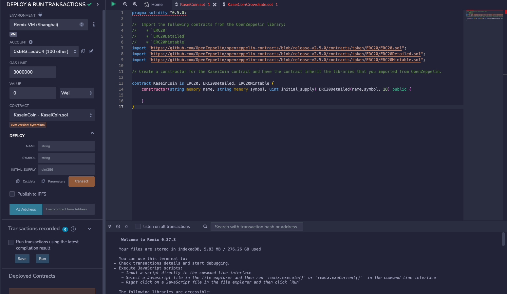
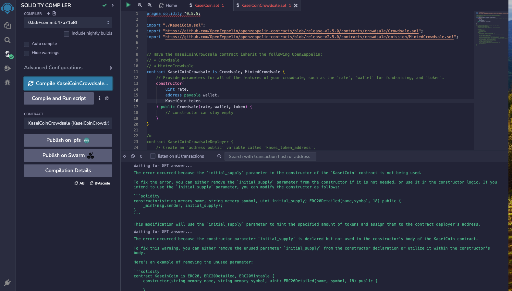
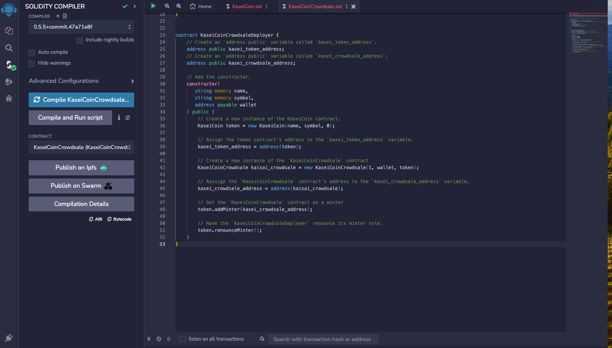

# KaseiCoin

# Objective
KaseiCoin will be a fungible token that’s ERC-20 compliant launch via crowdsale.

# Process
1) Create the KaseiCoin Token Contract that is ERC-20 compliant
2) Create the KaseiCoin Crowdsale Contract
3) Create the KaseiCoin Deployer Contract
4) Deploy and Test the Crowdsale on a Local Blockchain

# Evaluation Evidence
  ##  Compiled KaseiCoin Contract
  
  ## Compiled KaseiCoin Crowdsale Contract
  
  ## Compiled KaseiCoin Deployer Contract
  
  
# Dependencies, Libraries & Files
  - https://remix.ethereum.org/
  - KaseiCoin.sol
  - KaseiCoinCrowdsale.sol
  - Images
    -  KaseiCoinContract.png
    -  KaseiCoinCrowdsaleContract.png
    -  KaseiCoinDeployerContract.png
